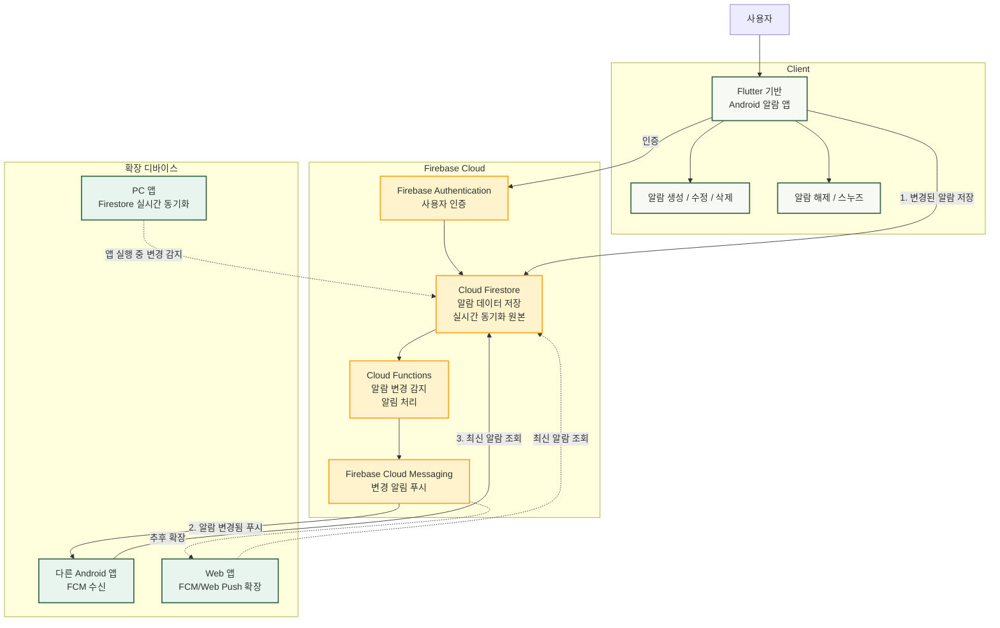

# Team Project 1 — Let's alarm (렛츠알람)

Firebase 기반 Flutter 알람 앱 MVP 프로젝트입니다. 기본 구현은 Android에서 알람 생성, 요일/소리/진동/스누즈 세부 설정, 동기화, FCM, 로컬 알림을 먼저 완성하고, Web/Linux/Windows는 이후 확장 구현으로 다룹니다.

상세 기준, 아키텍처, 디자인 토큰, 보안 규칙, 남은 작업은 [AGENTS.md](./AGENTS.md)를 단일 기준 문서로 사용합니다.

---

## 1. 빠른 실행 & 기본 검증 (Quick Start)

### 빠른 실행

```bash
cd synced_alarm
/home/devuser/flutter/bin/flutter pub get
/home/devuser/flutter/bin/flutter run -d <android-device-id>
```

기본 실행은 Firebase 없이 로컬 데모 저장소를 사용합니다.

Firebase 로그인/그룹 동기화 모드는 다음처럼 실행합니다. 이 모드에서도 로그인 전에는 로컬 알람 기능을 바로 사용할 수 있고, 설정에서 로그인한 뒤 그룹을 선택하면 Firebase 동기화로 전환됩니다.

```bash
cd synced_alarm
/home/devuser/flutter/bin/flutter run -d <android-device-id> \
  --dart-define=USE_FIREBASE=true
```

### 기본 검증

```bash
cd synced_alarm
/home/devuser/flutter/bin/dart format .
/home/devuser/flutter/bin/flutter analyze
/home/devuser/flutter/bin/flutter test
```

---

## 2. 팀프로젝트 제안서 (TEAM_PROJECT_PROPOSAL)

### (1) 프로그램 개요 및 설명

#### 프로젝트명
**Android 우선 실시간 동기화 알람 앱**

#### 개발 배경
기존 알람 앱은 대부분 한 기기 안에서만 동작합니다. 스마트폰에서 알람을 설정하더라도 다른 기기와 알람 상태를 공유하거나, 알람 해제와 스누즈 같은 제어 상태를 함께 관리하기 어렵습니다.

본 프로젝트는 먼저 Android 앱에서 알람 기능을 안정적으로 구현하고, 이후 다른 플랫폼으로 확장할 수 있는 구조를 목표로 합니다. 수업 프로젝트 범위에서는 세부 기술을 과하게 고정하기보다, Android 기본 기능과 동기화 흐름을 완성하는 데 집중합니다.

#### 프로그램 설명
사용자는 Android 앱에서 알람을 생성, 수정, 삭제하고 알람이 울릴 때 앱 알림을 받을 수 있습니다. 알람 상태는 Firebase 기반 클라우드 저장소를 통해 관리하여, 이후 Web이나 PC 앱으로 확장할 수 있도록 설계합니다.

기본 구현은 Android 앱을 중심으로 진행하며, Web/Linux/Windows 구현은 Android 기본 기능이 완성된 뒤 확장 계획에 포함합니다.

#### 개발 플랫폼 및 기술
*   기본 구현 플랫폼: Android
*   확장 고려 플랫폼: Web, PC 앱
*   개발 프레임워크: Flutter
*   데이터 관리: Firebase 기반 클라우드 저장소
*   알림 기능: Android 푸시 및 로컬 알림
*   디자인 기준: Stitch 생성 알람 앱 디자인

### (2) 전체 구조도 설명

*   발표용 FigJam 구조도: [Firebase 동기화와 Android 로컬 알람 구조](https://www.figma.com/board/8B2eBuLka5J5P3yXcT1ifS)



#### 구조 설명
전체 구조는 Flutter 기반 Android 앱, Firebase Cloud, 확장 디바이스 영역으로 나눌 수 있습니다. 사용자는 Android 앱에서 알람을 설정하고, 앱은 변경된 알람 정보를 Cloud Firestore에 저장합니다. Firestore는 실제 알람 데이터의 저장소이자 동기화 원본 역할을 합니다.

Cloud Functions는 Firestore의 알람 변경을 감지해 Firebase Cloud Messaging에 변경 알림 전송을 요청합니다. FCM은 알람 데이터 전체를 저장하거나 직접 동기화하는 역할이 아니라, FCM을 지원하는 Android 앱과 Web 앱에 "알람이 변경됨"을 알려주는 푸시 신호 역할을 합니다.

PC 앱은 FCM 직접 수신 대상이 아니라, 앱이 실행 중일 때 Firestore의 실시간 변경을 감지해 최신 알람 상태를 동기화하는 방식으로 확장합니다.

기본 구현 단계에서는 Flutter 기반 Android 앱의 알람 생성, 수정, 삭제, 알림 동작을 우선 완성합니다. 이후 같은 알람 데이터를 Web이나 PC 앱에서도 확인하고 제어할 수 있도록 확장할 수 있습니다.

### (3) 주요 기능 설명

#### 기본 구현 기능(Android)
*   알람 생성, 수정, 삭제
*   알람 활성화 및 비활성화
*   알람 이름과 시간 설정
*   알람 목록 표시
*   알람 울림 알림 표시
*   알람 해제 및 스누즈 기능
*   테스트 알람 기능
*   알람 상태 저장 및 동기화

#### 확장 구현 기능
*   Web에서 알람 목록 확인
*   PC 앱에서 알람 목록 확인
*   다른 기기에서 알람 해제 또는 스누즈
*   여러 기기 간 알람 상태 공유

### (4) 팀원 역할 분담 내용

| 팀원 | 담당 영역 | 주요 업무 |
| --- | --- | --- |
| 김준형 | 기획 및 일정 조율 | 개발 일정 관리 및 요구사항 정의 |
| 양상현 | 자료조사 및 발표 자료 | 관련 기술 조사 및 프레젠테이션 작성 |
| 정준호 | 개발 및 구현 | 알람 Core & Firebase 동기화 아키텍처 개발 |
| 김민준 | UI/UX 디자인 | 와이어프레임 설계 및 Stitch 기반 그린 테마 적용 |

### (5) 개발 일정(14주차까지의 일정)

| 주차 | 개발 내용 | 산출물 |
| --- | --- | --- |
| 9주차 | 프로젝트 주제 확정 및 Android 우선 구현 범위 정리 | 제안서, 전체 구조도 |
| 10주차 | Flutter 프로젝트 구성 및 알람 앱 기본 화면 구현 | 메인 화면, 설정 화면 |
| 11주차 | 알람 생성, 수정, 삭제와 기본 저장 흐름 구현 | 알람 관리 기능 |
| 12주차 | Firebase 기반 동기화와 Android 알림 기능 구현 | 동기화 및 알림 기능 |
| 13주차 | 알람 해제, 스누즈, 테스트 알람과 UI 보완 | 개선된 Android 앱 |
| 14주차 | 최종 통합 테스트 및 발표 준비 | 최종 데모, 발표 자료, 제출 문서 |

---

## 3. 팀프로젝트 발표 공지 사항 (발표자료공지)

### 1. 팀프로젝트 발표평가 내용
*   팀당 발표시간 10분 내외, 질의응답 5분 내외

#### [정량적 평가 내용] : 40점
*   **(1) 프로그램 개요 및 설명 (5점)**: 프로그램에 대한 개요 및 설명, 팀원 소개 및 역할 분담 내용
*   **(2) 전체 구조도 설명 (10점)**: 전체 시스템 구조도 설명, 주요 클래스에 대한 흐름 설명, 기능에 대한 흐름 및 진행에 대한 설명
*   **(3) 주요 기능 설명 (10점)**: UI 기능 중심으로 각 기능에 대한 설명, 제공되는 주요 기능 설명
*   **(4) 프로그램 시연 (5점)**
*   **(5) 발표력 및 발표시간의 적정성 (5점)**
*   **(6) 질문에 대한 답변 (5점)**

#### [정성적 평가 내용]
*   전체적인 흐름 및 구현 난이도에 따른 A, B, C 레벨 평가

### 2. 팀프로젝트 발표 안내
*   일정 : 13주차(05.27.수) 수업시간 (14주차 06.03.수 휴일로 인한 조정)
*   방법 : 수업시간 중 대면 구두 발표
*   내용 : 위 1번 참조
*   시간 : 각 팀별로 15분 내외 (질의응답 포함)
*   타 팀에 대한 평가 포함 (발표평가지 당일 배부)

---

## 4. 발표자료 정보 전달 문서 (프로젝트 상세 요약)

### (1) 프로그램 개요 및 설명

#### 프로젝트명
**Let's alarm** (렛츠알람) — 멀티 디바이스 실시간 동기화 알람 앱

#### 개발 배경
*   기존 알람 앱은 **한 기기 안에서만 동작**하여, 여러 기기 간 알람 상태 공유나 해제/스누즈 제어 동기화가 불가능합니다.
*   이를 해결하기 위해 **Flutter + Firebase** 기반의 멀티 디바이스 실시간 알람 앱을 기획하였습니다.
*   먼저 **Android 앱**에서 알람 기능을 안정적으로 구현하고, 이후 Web/PC로 **확장 가능한 구조**를 목표로 합니다.

#### 프로그램 설명
사용자는 Android 앱에서 알람을 생성·수정·삭제하고, 알람이 울릴 때 앱 알림을 받을 수 있습니다. 이메일 계정으로 로그인하면 **그룹**을 만들거나 초대 코드로 참가하여, 같은 그룹에 속한 **여러 기기가 동일한 알람을 실시간으로 공유**합니다. 한 기기에서 알람을 해제하거나 스누즈하면 **다른 기기에도 즉시 반영**됩니다.

#### 개발 플랫폼 및 기술 스택
| 구분 | 내용 |
|---|---|
| **기본 구현 플랫폼** | Android |
| **확장 고려 플랫폼** | Web, Linux, Windows |
| **개발 프레임워크** | Flutter (Dart) |
| **상태 관리** | Riverpod (Provider 패턴) |
| **백엔드/인증** | Firebase (Authentication, Cloud Firestore, FCM, Cloud Functions) |
| **네이티브 코드** | Kotlin (Android 알람/진동/Activity 제어) |
| **IDE** | Android Studio / VS Code |

#### 팀원 소개 및 역할 분담
| 팀원 | 담당 영역 |
|---|---|
| 김준형 | 계획, 디자인, 기능 구현, 테스트 |
| 양상현 | 자료조사 및 발표자료 준비, 테스트 |
| 정준호 | 코드 작성, 기능 구현, 테스트 |
| 김민준 | UI/UX 기획 및 자료조사, 요구사항 정의서 작성, 테스트 |

#### 프로젝트 규모
| 항목 | 수치 |
|---|---|
| Flutter(Dart) 소스 코드 | 약 9,100줄 (26개 파일) |
| Kotlin 네이티브 코드 | 약 530줄 (8개 파일) |
| Cloud Functions (JavaScript) | 약 410줄 (1개 파일) |
| Firestore 보안 규칙 | 약 180줄 |
| 자동화 테스트 코드 | 약 1,380줄 (7개 파일, 47개 테스트 케이스) |
| Git 커밋 수 | 48개 커밋 |

### (2) 전체 구조도 설명

#### 2-1. 전체 시스템 구조도

*   편집 가능한 발표용 구조도: [Firebase 동기화와 Android 로컬 알람 구조](https://www.figma.com/board/8B2eBuLka5J5P3yXcT1ifS)
*   발표 핵심: **FCM은 변경 및 제어 동기화 신호를 전달하고, 실제 정각 울림은 각 Android 기기의 로컬 예약이 담당합니다.**

```
┌─────────────────────────────────────────────────────────────────┐
│                     Firebase Cloud                              │
│                                                                 │
│   ┌─────────────────┐  ┌──────────────┐  ┌──────────────────┐  │
│   │  Authentication  │  │  Firestore   │  │ Cloud Functions  │  │
│   │ (Email/Password) │  │  (실시간 DB) │  │ (서버리스 로직) │  │
│   └────────┬────────┘  └──────┬───────┘  └────────┬─────────┘  │
│            │                  │                    │             │
│            │                  │   알람 변경 감지    │             │
│            │                  │◄──────────────────►│             │
│            │                  │                    │             │
│            │                  │         ┌──────────┴──────────┐ │
│            │                  │         │   FCM (푸시 전송)    │ │
│            │                  │         └──────────┬──────────┘ │
└────────────┼──────────────────┼────────────────────┼────────────┘
             │                  │                    │
     ────────┼──────────────────┼────────────────────┼────────────
             │                  │                    │
    ┌────────┴──────────────────┴────────────────────┴────────┐
    │              Flutter Android 앱 (Let's alarm)           │
    │                                                         │
    │  ┌─────────────┐  ┌──────────────┐  ┌───────────────┐  │
    │  │  UI Layer    │  │ Data Layer   │  │Platform Layer │  │
    │  │  (화면/위젯) │  │ (Repository) │  │ (알림/알람)   │  │
    │  └─────────────┘  └──────────────┘  └───────────────┘  │
    │                                                         │
    │  ┌─────────────────────────────────────────────────┐    │
    │  │     Kotlin Native (AlarmManager, Vibration)     │    │
    │  └─────────────────────────────────────────────────┘    │
    └─────────────────────────────────────────────────────────┘
             │                                    │
    ┌────────┴────────┐                ┌──────────┴──────────┐
    │  Android 기기 A  │   실시간 동기화  │  Android 기기 B     │
    │  (알람 생성/해제) │◄──────────────►│ (알람 수신/동기화)   │
    └─────────────────┘                └─────────────────────┘
```

#### 2-2. 동기화 흐름 설명
1. **사용자 → 앱**: 알람 생성/수정/삭제/해제/스누즈
2. **앱 → Firestore**: 변경된 알람 데이터를 클라우드에 저장
3. **Firestore → Cloud Functions**: 알람 변경 이벤트 감지 (`onAlarmWrite`, `onCommandCreate`)
4. **Cloud Functions → FCM**: 같은 그룹의 모든 기기에 데이터 메시지 전송 (500개 단위 청크 분할)
5. **FCM → 다른 기기**: 백그라운드에서도 데이터 페이로드를 수신하여 **로컬 알람 즉시 재스케줄링**
6. **Dismiss/Snooze 명령 동기화**: 한 기기에서 알람을 해제하면, `alarm.command`를 통해 다른 기기의 울림 화면도 **즉시 닫힘**

#### 2-3. Firestore 데이터 구조
```
users/{uid}                          ← 사용자 프로필
users/{uid}/groups/{groupId}         ← 가입한 그룹 참조
users/{uid}/devices/{deviceId}       ← 개인 기기 목록
groups/{groupId}                     ← 그룹 정보
groups/{groupId}/members/{uid}       ← 그룹 멤버
groups/{groupId}/alarms/{alarmId}    ← 공유 알람 데이터
groups/{groupId}/devices/{deviceId}  ← 그룹 등록 기기 (FCM 토큰)
groups/{groupId}/commands/{commandId}← 해제/스누즈 명령
groupSecrets/{groupId}               ← 초대 코드 해시 (클라이언트 읽기 금지)
```

#### 2-4. 앱 내부 코드 구조 (레이어드 아키텍처)
```
synced_alarm/
├── lib/
│   ├── main.dart                        ← 앱 진입점
│   ├── firebase_options.dart            ← Firebase 설정
│   └── src/
│       ├── app/                         ← 앱 셸 (MaterialApp)
│       │   └── synced_alarm_app.dart
│       ├── models/                      ← 데이터 모델
│       │   ├── alarm.dart               ← Alarm 모델 (이름, 시간, 요일, 설정 등)
│       │   ├── account.dart             ← Account, SyncGroup 모델
│       │   └── device_registration.dart ← DeviceRegistration 모델
│       ├── data/                        ← 데이터 접근 계층 (Repository 패턴)
│       │   ├── alarm_repository.dart         ← AlarmRepository 인터페이스
│       │   ├── account_repository.dart       ← AccountRepository 인터페이스
│       │   ├── local_demo_alarm_repository.dart  ← 로컬 저장소 구현
│       │   ├── firebase_alarm_repository.dart    ← Firebase 저장소 구현
│       │   ├── firebase_account_repository.dart  ← Firebase 계정 구현
│       │   ├── firebase_device_registrar.dart    ← FCM 기기 등록/해제
│       │   ├── firebase_operation_timeout.dart   ← Firestore 타임아웃 보호
│       │   └── app_providers.dart                ← Riverpod Provider 정의
│       ├── features/                    ← 화면/기능 UI
│       │   ├── alarms/
│       │   │   ├── alarm_home_screen.dart     ← 메인 홈 화면 (알람 목록)
│       │   │   ├── alarm_editor_sheet.dart    ← 알람 생성/수정 바텀시트
│       │   │   ├── alarm_ring_screen.dart     ← 알람 울림 화면 (해제/스누즈)
│       │   │   ├── alarm_due_tick_tracker.dart ← 알람 트리거 추적
│       │   │   └── permission_guide_screen.dart ← 권한 안내 화면
│       │   ├── account/
│       │   │   ├── auth_screen.dart            ← 로그인/회원가입 화면
│       │   │   ├── account_gate.dart           ← 인증 게이트
│       │   │   ├── account_settings_screen.dart← 계정 설정 화면
│       │   │   └── group_setup_screen.dart     ← 그룹 생성/참가/관리 화면
│       │   └── settings/
│       │       └── settings_sheet.dart         ← 설정 화면 (테마, 언어, 앱 정보)
│       ├── design/                      ← 디자인 시스템
│       │   ├── app_theme.dart           ← Stitch 기반 그린 테마 토큰
│       │   └── app_localizations.dart   ← 한국어/영어 다국어 지원
│       └── platform/                    ← 플랫폼 연동 계층
│           ├── alarm_notification_service.dart ← 알림/FCM/스케줄링 서비스
│           └── alarm_task_controller.dart      ← 네이티브 채널 제어
```

#### 2-5. 주요 클래스 흐름 설명

##### 알람 생성 흐름
```
사용자 입력 → AlarmEditorSheet (UI)
  → AlarmListController (상태 관리)
    → AlarmRepository.addAlarm() (데이터 저장)
      ├── [로컬 모드] LocalDemoAlarmRepository → SharedPreferences
      └── [Firebase 모드] FirebaseAlarmRepository → Firestore
        → Cloud Functions (onAlarmWrite) → FCM → 다른 기기
```

##### 알람 울림 흐름
```
Android AlarmManager → ForegroundAlarmReceiver (Kotlin)
  → Flutter MethodChannel
    → AlarmNotificationService (알림 표시)
      → AlarmHomeScreen → AlarmRingScreen (울림 UI)
        → 사용자: Dismiss 또는 Snooze
          → Firestore 상태 업데이트
            → Cloud Functions (onCommandCreate)
              → FCM → 다른 기기의 AlarmRingScreen 닫힘
```

##### 멀티 디바이스 동기화 흐름
```
기기 A: 알람 생성/수정/삭제
  → Firestore 저장
    → Cloud Functions (onAlarmWrite)
      → FCM 데이터 메시지 전송 (무소음 Silent Sync)
        → 기기 B (백그라운드/포그라운드)
          → AlarmNotificationService.showRemoteMessage()
            → FCM 페이로드에서 알람 속성 직접 파싱
              → Android 로컬 알람 즉시 재스케줄링
                (Firestore GET 없이 오프라인에서도 동작)
```

### (3) 주요 기능 설명

#### 3-1. 기본 구현 기능 (Android) — 전체 완성
| 기능 | 설명 | 구현 상태 |
|---|---|---|
| **알람 목록 표시** | 홈 화면에서 모든 알람을 카드 형태로 표시, 그룹 뱃지 포함 | ✅ 완료 |
| **알람 생성** | 바텀시트에서 이름, 시간, 요일, 소리/진동/스누즈 설정 | ✅ 완료 |
| **알람 수정** | 기존 알람 탭하여 설정 편집, revision 증가로 버전 충돌 방지 | ✅ 완료 |
| **알람 삭제** | 스와이프 또는 편집 화면에서 삭제 | ✅ 완료 |
| **알람 활성화/비활성화** | 토글 스위치로 on/off, 비활성 시 예약 해제 | ✅ 완료 |
| **알람 울림 알림** | Full-screen intent, 잠금화면 표시, 화면 자동 켜기 | ✅ 완료 |
| **알람 해제 (Dismiss)** | 앱 내부 + 시스템 알림 액션 버튼 + 잠금화면 전용 Activity | ✅ 완료 |
| **스누즈 (Snooze)** | 설정된 간격/횟수만큼 재알림, Ongoing 알림으로 상태 표시 | ✅ 완료 |
| **알람 동기화** | Firebase 기반 실시간 동기화 + FCM 백그라운드 무소음 동기화 | ✅ 완료 |

#### 3-2. 확장 구현 기능 — 구현 완료 항목
*   **이메일 계정 관리**: Email/Password 회원가입, 로그인, 로그아웃
*   **그룹 관리**: 그룹 생성, 초대 코드 참가, 그룹 전환
*   **다중 그룹 알람 통합**: 가입한 모든 그룹의 알람을 하나의 목록에 통합 표시
*   **멀티 디바이스 동기화**: 같은 그룹의 여러 기기가 실시간으로 알람 공유
*   **원격 해제/스누즈 동기화**: 한 기기에서 해제 시 다른 기기 울림 화면 즉시 닫힘
*   **테마 변경**: 라이트/다크/시스템 모드 전환, SharedPreferences 영속
*   **한국어/영어 전환**: 인앱 언어 변경 지원
*   **기기 관리**: 등록 기기 목록 조회, 다른 기기 해제
*   **보안**: Firestore 규칙 기반 그룹 멤버 접근 제어, 초대 코드 해시 저장
*   **소리/진동 개별 설정**: 알람별 소리 on/off, 진동 on/off
*   **로컬 모드**: Firebase 없이도 알람 사용 가능 (SharedPreferences 기반 영속)

#### 3-3. 각 화면별 UI 기능 설명
*   **① 홈 화면 (AlarmHomeScreen)**: 3개 하단 탭 (알람 목록/기록/설정), 알람 카드 레이아웃, 스누즈 뱃지, 실시간 동기화 상태 표시
*   **② 알람 편집 바텀시트 (AlarmEditorSheet)**: 시간 설정, 요일 반복(월~일 칩), 소리/진동 여부, 스누즈 옵션 및 그룹 설정
*   **③ 알람 울림 화면 (AlarmRingScreen)**: Full-screen Activity 알람 표시, 해제/스누즈 제어, 자동 스누즈 만료 타이머
*   **④ 로그인/회원가입 화면 (AuthScreen)**: 로그인/회원가입 폼 및 다국어 친숙 에러 피드백
*   **⑤ 그룹 관리 화면 (GroupSetupScreen)**: 그룹 생성, 초대 코드로 참여, 그룹 멤버 및 기기 목록 팝업 조회
*   **⑥ 계정 설정 화면 (AccountSettingsScreen)**: 로그인 정보 제공 및 활성 기기 관리
*   **⑦ 설정 화면 (SettingsSheet)**: 테마 변경, 언어 전환, 전체화면 알람 및 시스템 권한 이동 지원

#### 3-4. 기술적 구현 난이도가 높은 포인트
1. **백그라운드 FCM 수신 시 Firestore 없이 즉시 로컬 알람 스케줄링**: OS 절전/도즈 모드 최적화
2. **Kotlin 네이티브 AlarmManager + Flutter 브릿지**: `LaunchRouterActivity` 분기 라우팅
3. **멀티 디바이스 Dismiss/Snooze 명령 동기화**: 실시간 화면 종료 및 중복 제어 처리
4. **알람 재울림 방지 (DueTickTracker)**: 12시간 주기 sliding window 틱 정리 및 영속 상태 보존

### (4) 프로그램 시연 시나리오
*   **시나리오 1: 로컬 모드 기본 알람**: 알람 생성, 토글 활성/비활성, 수정, 스와이프 삭제 시연
*   **시나리오 2: 알람 울림 및 제어**: 알람 발생 -> 스누즈 예약 -> 다시 울릴 시 해제 처리
*   **시나리오 3: 로그인 및 그룹 생성**: 회원가입 후 그룹 생성 및 초대 코드 발급
*   **시나리오 4: 멀티 디바이스 동기화 (핵심)**: 기기 A에서 알람 생성/수정이 기기 B로 실시간 동기화, 알람 발생 시 기기 A에서 끄면 기기 B도 즉시 해제

---

## 5. AI 발표자료(PPT) 제작 의뢰용 프롬프트

아래 내용을 슬라이드 제작 AI에 그대로 전달합니다.

```text
UI/UX 프로그래밍 팀프로젝트 발표용 PPT를 제작해 주세요.

[발표 평가 기준과 제작 범위]
- 공지의 PPT 관련 평가 항목에 정확히 맞춰 제작합니다.
  1. 프로그램 개요 및 설명, 팀원 소개 및 역할 분담
  2. 전체 시스템 구조도, 주요 클래스 흐름, 기능 흐름 및 구현 진행 설명
  3. UI 기능 중심의 주요 기능 설명
- 별도의 프로그램 시연 슬라이드, 구현 결과 정리 슬라이드, Q&A 슬라이드는 만들지 마세요.
- 시연과 질의응답은 구두 발표에서 진행하며, 이 자료는 시연 이전까지의 설명 자료로 구성합니다.

[프로젝트 정보]
- 프로젝트명: Let's alarm (렛츠알람)
- 주제: Android 우선 실시간 동기화 알람 앱
- 발표 시간: 발표 약 10분, 질의응답 약 5분
- 팀: 6조
- 팀원 및 역할:
  - 김준형: 계획, 디자인, 기능 구현, 테스트
  - 양상현: 자료조사, 발표자료 준비, 테스트
  - 정준호: 코드 작성, 기능 구현, 테스트
  - 김민준: UI/UX 기획, 요구사항 정의서 작성, 테스트

[반드시 지켜야 할 사실]
- 기본 구현 대상은 Android이며, 앱은 Flutter(Dart)로 개발했습니다.
- Firebase Authentication, Cloud Firestore, Cloud Functions, Firebase Cloud Messaging(FCM)을 사용합니다.
- 알람이 실제 정각에 울리는 역할은 각 Android 기기의 로컬 예약 알람입니다.
- FCM은 다른 기기에서 변경된 알람 정보나 해제/스누즈 제어를 전달해 로컬 예약 및 표시 상태를 동기화하는 역할입니다.
- 이미 기기에 예약된 알람은 네트워크가 없어도 동작할 수 있지만, 다른 기기의 새 변경을 반영하려면 네트워크 연결이 필요합니다.
- Web/Linux/Windows는 구현 완료 기능처럼 표현하지 말고 향후 확장 계획으로만 표시합니다.
- 검증되지 않은 응답 시간(예: 1초 내), 완벽한 오프라인 동기화, 완벽한 절전 극복 같은 과장 표현을 사용하지 마세요.

[디자인 방향]
- 16:9 비율, 한국어 발표 자료, 총 8장으로 구성해 주세요.
- 색상은 Primary #386948, Primary Container #b9efc5, Background #f7faf4, Text #2c342e를 사용합니다.
- Pretendard 또는 Inter 계열의 깔끔한 산세리프 서체를 사용합니다.
- 작은 본문을 많이 넣지 말고, 화면 캡처와 구조도 중심으로 구성합니다.
- 다이어그램은 발표 화면에서도 글자가 읽히도록 크게 배치하고, 세부 설명은 도식 주변의 짧은 라벨과 발표자 노트로 분리합니다.
- 실제 앱 스크린샷이 제공되는 영역에는 임의 UI 이미지를 만들지 말고 스크린샷 삽입 위치를 확보해 주세요.
- 각 슬라이드 우측 상단에 해당 평가 항목을 작게 표시합니다. 예: `평가 (2) 전체 구조도 설명`.

[슬라이드 구성]

Slide 1. 표지 및 팀원 역할 - 평가 (1)
- 제목: Let's alarm (렛츠알람)
- 부제: Android 우선 실시간 동기화 알람 앱
- 과목명 `UI/UX 프로그래밍`, `6조`, 팀원 4명과 담당 역할을 표 형태로 표시합니다.
- 중앙에는 실제 앱 홈 화면을 넣을 스마트폰 프레임 1개를 크게 배치합니다.
- 핵심 문장: `여러 Android 기기에서 같은 알람 변경 상태를 공유하는 Flutter 알람 앱`

Slide 2. 프로그램 개요 및 개발 목표 - 평가 (1)
- 왼쪽에 문제, 오른쪽에 해결 방향을 배치합니다.
  - 문제: 기기마다 알람 설정과 해제/스누즈 상태가 분리됨
  - 해결 방향: Android 알람 기능을 먼저 완성하고 Firebase로 여러 기기의 변경 상태를 공유
- 구현 범위를 하단에 명확히 구분합니다.
  - 기본 구현: Flutter Android 앱, 로컬 알람, Firebase 로그인/그룹 동기화
  - 향후 확장: Web/Linux/Windows
- 기술 배지: Flutter(Dart), Firebase, Kotlin(Android)

Slide 3. 주요 UI 기능 I - 알람 관리 - 평가 (3)
- 실제 앱의 `AlarmHomeScreen`과 `AlarmEditorSheet` 스크린샷 2개를 크게 배치합니다.
- 홈 화면 지시선 라벨:
  - 알람 목록 확인
  - 활성화/비활성화 토글
  - 동기화 상태 표시
- 편집 화면 지시선 라벨:
  - 이름과 시간 설정
  - 요일 반복 설정
  - 소리/진동 설정
  - 다시 알림 사용, 스누즈 간격/횟수 설정
- 긴 기능 목록 대신 실제 UI에서 조작하는 위치를 중심으로 설명합니다.

Slide 4. 주요 UI 기능 II - 울림과 계정 동기화 - 평가 (3)
- 실제 앱의 `AlarmRingScreen`, 로그인/그룹 관리 화면 스크린샷을 배치합니다.
- 울림 화면 설명:
  - 잠금화면에서 표시되는 알람 화면
  - Dismiss로 울림 종료
  - Snooze로 설정 시간 뒤 재알림
- 계정/그룹 설명:
  - 로그아웃 상태에서는 로컬 알람 사용
  - 로그인 후 그룹을 선택하면 공유 알람 동기화 사용
- 이 슬라이드에서는 기능 UI만 설명하고 Firebase 내부 처리 흐름은 다음 슬라이드로 넘깁니다.

Slide 5. 전체 시스템 구조도 - 평가 (2)
- 제목: Firebase 기반 동기화 알람 구조
- 가로형 블록 구조도로 다음 요소를 표현합니다.
  사용자 -> 기기 A: Flutter Android 앱 -> Cloud Firestore -> Cloud Functions -> FCM -> 기기 B: Flutter Android 앱
- 기기 A와 기기 B 각각의 내부에 `Android 로컬 알람 예약 / 정각 울림`을 작은 하위 블록으로 넣습니다.
- `Firebase Authentication`은 앱과 연결된 인증 블록으로, Firestore는 `공유 알람 원본 데이터`로 표시합니다.
- 화살표 라벨:
  1. 알람 생성/수정 저장
  2. Firestore 변경 감지
  3. FCM 변경 데이터 전달
  4. 다른 기기의 로컬 예약 갱신
- 가장 강조할 문장: `FCM은 동기화 신호를 전달하고, 실제 알람 울림은 Android 로컬 예약이 담당합니다.`

Slide 6. 주요 클래스 흐름 - 알람 생성과 저장 - 평가 (2)
- 클래스 상속 관계도가 아닌 시퀀스 다이어그램으로 표현합니다.
- 참여 객체: 사용자, `AlarmEditorSheet`, `AlarmListController`, `AlarmRepository`, `AlarmNotificationService`, 저장소
- 흐름:
  1. 사용자가 `AlarmEditorSheet`에서 알람 정보를 입력하고 저장
  2. `AlarmListController`가 추가/수정 요청 처리
  3. `AlarmRepository`가 사용 상태에 따라 데이터를 저장
  4. `AlarmNotificationService`가 Android 로컬 알람 예약을 갱신
- Repository 분기 박스를 별도로 표시합니다.
  - 로그아웃/로컬 모드: `LocalDemoAlarmRepository -> SharedPreferences`
  - 로그인 및 활성 그룹 모드: `FirebaseAlarmRepository -> Cloud Firestore`
- 이 슬라이드는 앱 코드 내부에서 저장과 예약이 연결되는 이유를 설명하는 용도입니다.

Slide 7. 기능 흐름 및 진행 - 동기화와 알람 제어 - 평가 (2)
- 위쪽에는 기기 간 변경 동기화 시퀀스를 표현합니다.
  `기기 A 알람 수정 -> Firestore -> Cloud Functions -> FCM -> 기기 B AlarmNotificationService -> Android 로컬 예약 갱신`
- 아래쪽에는 알람 발생 이후 제어 흐름을 표현합니다.
  `Android 예약 시간 도달 -> AlarmRingScreen / 소리 / 진동 -> Dismiss 또는 Snooze`
  - Dismiss: 현재 울림 정리, 로그인/그룹 사용 시 제어 상태 전달
  - Snooze: 설정된 시간 뒤 다시 울리도록 로컬 예약, 로그인/그룹 사용 시 제어 상태 전달
- 진행 상태 범례를 넣습니다.
  - 구현 반영: Android 기본 알람 UI, 로컬 예약, 로그인/그룹 동기화 코드
  - 실기기 확인 필요: 두 Android 기기 간 변경 및 제어 동기화 안정성
  - 향후 확장: Web/Linux/Windows
- 보조 문장: `이미 로컬에 예약된 알람은 네트워크가 없어도 울릴 수 있으나, 다른 기기의 새 변경 반영에는 네트워크가 필요합니다.`

Slide 8. 데이터 구조와 보안 - 평가 (2)
- Firestore 컬렉션은 발표 화면에서 읽히도록 핵심 6개만 단순 트리 또는 카드로 표현합니다.
  users/{uid}
  groups/{groupId}/members/{uid}
  groups/{groupId}/alarms/{alarmId}
  groups/{groupId}/devices/{deviceId}
  groups/{groupId}/commands/{commandId}
  groupSecrets/{groupId}
- 보안 포인트:
  그룹 멤버만 그룹 데이터 접근
  초대 코드는 해시로 저장
  FCM 토큰은 등록 기기 문서에서 관리
- 화면 한쪽에 `Firebase Authentication`, `Firestore Rules`, `Cloud Functions / FCM`의 역할을 1문장씩 표시합니다.
  - Authentication: 로그인 사용자 식별
  - Rules: 그룹 멤버만 공유 알람 접근
  - Functions/FCM: 변경 내용을 등록된 Android 기기로 전달

[출력 요구]
- 각 슬라이드에는 제목, 평가 항목, 핵심 한 문장, 사용할 시각 자료 유형을 명확히 구성해 주세요.
- 구조도와 흐름도에는 아이콘보다 읽기 쉬운 박스와 화살표를 우선 사용하세요.
- UI 스크린샷 자리는 실제 이미지가 삽입되도록 프레임과 캡션만 구성하세요.
- 시연, 최종 결과 요약, Q&A용 별도 슬라이드는 제작하지 마세요.
- 구현 상태나 안정성을 사실 이상으로 과장하지 마세요.
```
