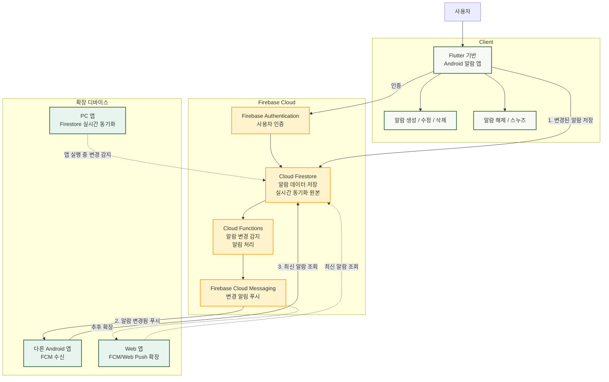

# Team Project 1 — Let's alarm (렛츠알람)

Firebase 기반 Flutter 알람 앱 MVP 프로젝트입니다. 기본 구현은 Android에서 알람 생성, 요일/소리/진동/스누즈 세부 설정, 동기화, FCM, 로컬 알림을 먼저 완성하고, Web/Linux/Windows는 이후 확장 구현으로 다룹니다.

상세 기준, 아키텍처, 디자인 토큰, 보안 규칙, 남은 작업은 [AGENTS.md](./AGENTS.md)를 단일 기준 문서로 사용합니다.

---

## 1. 빠른 실행 & 기본 검증 (Quick Start)

### 빠른 실행

```bash
cd synced_alarm
/home/devuser/flutter/bin/flutter pub get
/home/devuser/flutter/bin/flutter run -d <android-device-id>
```

기본 실행은 Firebase 없이 로컬 데모 저장소를 사용합니다.

Firebase 로그인/그룹 동기화 모드는 다음처럼 실행합니다. 이 모드에서도 로그인 전에는 로컬 알람 기능을 바로 사용할 수 있고, 설정에서 로그인한 뒤 그룹을 선택하면 Firebase 동기화로 전환됩니다.

```bash
cd synced_alarm
/home/devuser/flutter/bin/flutter run -d <android-device-id> \
  --dart-define=USE_FIREBASE=true
```

### 기본 검증

```bash
cd synced_alarm
/home/devuser/flutter/bin/dart format .
/home/devuser/flutter/bin/flutter analyze
/home/devuser/flutter/bin/flutter test
```

---

## 2. 팀프로젝트 제안서 (TEAM_PROJECT_PROPOSAL)

### (1) 프로그램 개요 및 설명

#### 프로젝트명
**Android 우선 실시간 동기화 알람 앱**

#### 개발 배경
기존 알람 앱은 대부분 한 기기 안에서만 동작합니다. 스마트폰에서 알람을 설정하더라도 다른 기기와 알람 상태를 공유하거나, 알람 해제와 스누즈 같은 제어 상태를 함께 관리하기 어렵습니다.

본 프로젝트는 먼저 Android 앱에서 알람 기능을 안정적으로 구현하고, 이후 다른 플랫폼으로 확장할 수 있는 구조를 목표로 합니다. 수업 프로젝트 범위에서는 세부 기술을 과하게 고정하기보다, Android 기본 기능과 동기화 흐름을 완성하는 데 집중합니다.

#### 프로그램 설명
사용자는 Android 앱에서 알람을 생성, 수정, 삭제하고 알람이 울릴 때 앱 알림을 받을 수 있습니다. 알람 상태는 Firebase 기반 클라우드 저장소를 통해 관리하여, 이후 Web이나 PC 앱으로 확장할 수 있도록 설계합니다.

기본 구현은 Android 앱을 중심으로 진행하며, Web/Linux/Windows 구현은 Android 기본 기능이 완성된 뒤 확장 계획에 포함합니다.

#### 개발 플랫폼 및 기술
*   기본 구현 플랫폼: Android
*   확장 고려 플랫폼: Web, PC 앱
*   개발 프레임워크: Flutter
*   데이터 관리: Firebase 기반 클라우드 저장소
*   알림 기능: Android 푸시 및 로컬 알림
*   디자인 기준: Stitch 생성 알람 앱 디자인

### (2) 전체 구조도 설명

*   발표용 FigJam 구조도: [Synced Alarm Simple Firebase Proposal Diagram](https://www.figma.com/board/8B2eBuLka5J5P3yXcT1ifS?utm_source=other&utm_content=edit_in_figjam&oai_id=&request_id=b452d917-f2ec-44e7-9385-7b16d8364d4d)



#### 구조 설명
전체 구조는 Flutter 기반 Android 앱, Firebase Cloud, 확장 디바이스 영역으로 나눌 수 있습니다. 사용자는 Android 앱에서 알람을 설정하고, 앱은 변경된 알람 정보를 Cloud Firestore에 저장합니다. Firestore는 실제 알람 데이터의 저장소이자 동기화 원본 역할을 합니다.

Cloud Functions는 Firestore의 알람 변경을 감지해 Firebase Cloud Messaging에 변경 알림 전송을 요청합니다. FCM은 알람 데이터 전체를 저장하거나 직접 동기화하는 역할이 아니라, FCM을 지원하는 Android 앱과 Web 앱에 "알람이 변경됨"을 알려주는 푸시 신호 역할을 합니다.

PC 앱은 FCM 직접 수신 대상이 아니라, 앱이 실행 중일 때 Firestore의 실시간 변경을 감지해 최신 알람 상태를 동기화하는 방식으로 확장합니다.

기본 구현 단계에서는 Flutter 기반 Android 앱의 알람 생성, 수정, 삭제, 알림 동작을 우선 완성합니다. 이후 같은 알람 데이터를 Web이나 PC 앱에서도 확인하고 제어할 수 있도록 확장할 수 있습니다.

### (3) 주요 기능 설명

#### 기본 구현 기능(Android)
*   알람 생성, 수정, 삭제
*   알람 활성화 및 비활성화
*   알람 이름과 시간 설정
*   알람 목록 표시
*   알람 울림 알림 표시
*   알람 해제 및 스누즈 기능
*   테스트 알람 기능
*   알람 상태 저장 및 동기화

#### 확장 구현 기능
*   Web에서 알람 목록 확인
*   PC 앱에서 알람 목록 확인
*   다른 기기에서 알람 해제 또는 스누즈
*   여러 기기 간 알람 상태 공유

### (4) 팀원 역할 분담 내용

| 팀원 | 담당 영역 | 주요 업무 |
| --- | --- | --- |
| 김준형 | 기획 및 일정 조율 | 개발 일정 관리 및 요구사항 정의 |
| 양상현 | 자료조사 및 발표 자료 | 관련 기술 조사 및 프레젠테이션 작성 |
| 정준호 | 개발 및 구현 | 알람 Core & Firebase 동기화 아키텍처 개발 |
| 김민준 | UI/UX 디자인 | 와이어프레임 설계 및 Stitch 기반 그린 테마 적용 |

### (5) 개발 일정(14주차까지의 일정)

| 주차 | 개발 내용 | 산출물 |
| --- | --- | --- |
| 9주차 | 프로젝트 주제 확정 및 Android 우선 구현 범위 정리 | 제안서, 전체 구조도 |
| 10주차 | Flutter 프로젝트 구성 및 알람 앱 기본 화면 구현 | 메인 화면, 설정 화면 |
| 11주차 | 알람 생성, 수정, 삭제와 기본 저장 흐름 구현 | 알람 관리 기능 |
| 12주차 | Firebase 기반 동기화와 Android 알림 기능 구현 | 동기화 및 알림 기능 |
| 13주차 | 알람 해제, 스누즈, 테스트 알람과 UI 보완 | 개선된 Android 앱 |
| 14주차 | 최종 통합 테스트 및 발표 준비 | 최종 데모, 발표 자료, 제출 문서 |

---

## 3. 팀프로젝트 발표 공지 사항 (발표자료공지)

### 1. 팀프로젝트 발표평가 내용
*   팀당 발표시간 10분 내외, 질의응답 5분 내외

#### [정량적 평가 내용] : 40점
*   **(1) 프로그램 개요 및 설명 (5점)**: 프로그램에 대한 개요 및 설명, 팀원 소개 및 역할 분담 내용
*   **(2) 전체 구조도 설명 (10점)**: 전체 시스템 구조도 설명, 주요 클래스에 대한 흐름 설명, 기능에 대한 흐름 및 진행에 대한 설명
*   **(3) 주요 기능 설명 (10점)**: UI 기능 중심으로 각 기능에 대한 설명, 제공되는 주요 기능 설명
*   **(4) 프로그램 시연 (5점)**
*   **(5) 발표력 및 발표시간의 적정성 (5점)**
*   **(6) 질문에 대한 답변 (5점)**

#### [정성적 평가 내용]
*   전체적인 흐름 및 구현 난이도에 따른 A, B, C 레벨 평가

### 2. 팀프로젝트 발표 안내
*   일정 : 13주차(05.27.수) 수업시간 (14주차 06.03.수 휴일로 인한 조정)
*   방법 : 수업시간 중 대면 구두 발표
*   내용 : 위 1번 참조
*   시간 : 각 팀별로 15분 내외 (질의응답 포함)
*   타 팀에 대한 평가 포함 (발표평가지 당일 배부)

---

## 4. 발표자료 정보 전달 문서 (프로젝트 상세 요약)

### (1) 프로그램 개요 및 설명

#### 프로젝트명
**Let's alarm** (렛츠알람) — 멀티 디바이스 실시간 동기화 알람 앱

#### 개발 배경
*   기존 알람 앱은 **한 기기 안에서만 동작**하여, 여러 기기 간 알람 상태 공유나 해제/스누즈 제어 동기화가 불가능합니다.
*   이를 해결하기 위해 **Flutter + Firebase** 기반의 멀티 디바이스 실시간 알람 앱을 기획하였습니다.
*   먼저 **Android 앱**에서 알람 기능을 안정적으로 구현하고, 이후 Web/PC로 **확장 가능한 구조**를 목표로 합니다.

#### 프로그램 설명
사용자는 Android 앱에서 알람을 생성·수정·삭제하고, 알람이 울릴 때 앱 알림을 받을 수 있습니다. 이메일 계정으로 로그인하면 **그룹**을 만들거나 초대 코드로 참가하여, 같은 그룹에 속한 **여러 기기가 동일한 알람을 실시간으로 공유**합니다. 한 기기에서 알람을 해제하거나 스누즈하면 **다른 기기에도 즉시 반영**됩니다.

#### 개발 플랫폼 및 기술 스택
| 구분 | 내용 |
|---|---|
| **기본 구현 플랫폼** | Android |
| **확장 고려 플랫폼** | Web, Linux, Windows |
| **개발 프레임워크** | Flutter (Dart) |
| **상태 관리** | Riverpod (Provider 패턴) |
| **백엔드/인증** | Firebase (Authentication, Cloud Firestore, FCM, Cloud Functions) |
| **네이티브 코드** | Kotlin (Android 알람/진동/Activity 제어) |
| **IDE** | Android Studio / VS Code |

#### 팀원 소개 및 역할 분담
| 팀원 | 담당 영역 |
|---|---|
| 김준형 | 계획, 디자인, 기능 구현, 테스트 |
| 양상현 | 자료조사 및 발표자료 준비, 테스트 |
| 정준호 | 코드 작성, 기능 구현, 테스트 |
| 김민준 | UI/UX 기획 및 자료조사, 요구사항 정의서 작성, 테스트 |

#### 프로젝트 규모
| 항목 | 수치 |
|---|---|
| Flutter(Dart) 소스 코드 | 약 9,100줄 (26개 파일) |
| Kotlin 네이티브 코드 | 약 530줄 (8개 파일) |
| Cloud Functions (JavaScript) | 약 410줄 (1개 파일) |
| Firestore 보안 규칙 | 약 180줄 |
| 자동화 테스트 코드 | 약 1,380줄 (7개 파일, 47개 테스트 케이스) |
| Git 커밋 수 | 48개 커밋 |

### (2) 전체 구조도 설명

#### 2-1. 전체 시스템 구조도

```
┌─────────────────────────────────────────────────────────────────┐
│                     Firebase Cloud                              │
│                                                                 │
│   ┌─────────────────┐  ┌──────────────┐  ┌──────────────────┐  │
│   │  Authentication  │  │  Firestore   │  │ Cloud Functions  │  │
│   │ (Email/Password) │  │  (실시간 DB) │  │ (서버리스 로직) │  │
│   └────────┬────────┘  └──────┬───────┘  └────────┬─────────┘  │
│            │                  │                    │             │
│            │                  │   알람 변경 감지    │             │
│            │                  │◄──────────────────►│             │
│            │                  │                    │             │
│            │                  │         ┌──────────┴──────────┐ │
│            │                  │         │   FCM (푸시 전송)    │ │
│            │                  │         └──────────┬──────────┘ │
└────────────┼──────────────────┼────────────────────┼────────────┘
             │                  │                    │
     ────────┼──────────────────┼────────────────────┼────────────
             │                  │                    │
    ┌────────┴──────────────────┴────────────────────┴────────┐
    │              Flutter Android 앱 (Let's alarm)           │
    │                                                         │
    │  ┌─────────────┐  ┌──────────────┐  ┌───────────────┐  │
    │  │  UI Layer    │  │ Data Layer   │  │Platform Layer │  │
    │  │  (화면/위젯) │  │ (Repository) │  │ (알림/알람)   │  │
    │  └─────────────┘  └──────────────┘  └───────────────┘  │
    │                                                         │
    │  ┌─────────────────────────────────────────────────┐    │
    │  │     Kotlin Native (AlarmManager, Vibration)     │    │
    │  └─────────────────────────────────────────────────┘    │
    └─────────────────────────────────────────────────────────┘
             │                                    │
    ┌────────┴────────┐                ┌──────────┴──────────┐
    │  Android 기기 A  │   실시간 동기화  │  Android 기기 B     │
    │  (알람 생성/해제) │◄──────────────►│ (알람 수신/동기화)   │
    └─────────────────┘                └─────────────────────┘
```

#### 2-2. 동기화 흐름 설명
1. **사용자 → 앱**: 알람 생성/수정/삭제/해제/스누즈
2. **앱 → Firestore**: 변경된 알람 데이터를 클라우드에 저장
3. **Firestore → Cloud Functions**: 알람 변경 이벤트 감지 (`onAlarmWrite`, `onCommandCreate`)
4. **Cloud Functions → FCM**: 같은 그룹의 모든 기기에 데이터 메시지 전송 (500개 단위 청크 분할)
5. **FCM → 다른 기기**: 백그라운드에서도 데이터 페이로드를 수신하여 **로컬 알람 즉시 재스케줄링**
6. **Dismiss/Snooze 명령 동기화**: 한 기기에서 알람을 해제하면, `alarm.command`를 통해 다른 기기의 울림 화면도 **즉시 닫힘**

#### 2-3. Firestore 데이터 구조
```
users/{uid}                          ← 사용자 프로필
users/{uid}/groups/{groupId}         ← 가입한 그룹 참조
users/{uid}/devices/{deviceId}       ← 개인 기기 목록
groups/{groupId}                     ← 그룹 정보
groups/{groupId}/members/{uid}       ← 그룹 멤버
groups/{groupId}/alarms/{alarmId}    ← 공유 알람 데이터
groups/{groupId}/devices/{deviceId}  ← 그룹 등록 기기 (FCM 토큰)
groups/{groupId}/commands/{commandId}← 해제/스누즈 명령
groupSecrets/{groupId}               ← 초대 코드 해시 (클라이언트 읽기 금지)
```

#### 2-4. 앱 내부 코드 구조 (레이어드 아키텍처)
```
synced_alarm/
├── lib/
│   ├── main.dart                        ← 앱 진입점
│   ├── firebase_options.dart            ← Firebase 설정
│   └── src/
│       ├── app/                         ← 앱 셸 (MaterialApp)
│       │   └── synced_alarm_app.dart
│       ├── models/                      ← 데이터 모델
│       │   ├── alarm.dart               ← Alarm 모델 (이름, 시간, 요일, 설정 등)
│       │   ├── account.dart             ← Account, SyncGroup 모델
│       │   └── device_registration.dart ← DeviceRegistration 모델
│       ├── data/                        ← 데이터 접근 계층 (Repository 패턴)
│       │   ├── alarm_repository.dart         ← AlarmRepository 인터페이스
│       │   ├── account_repository.dart       ← AccountRepository 인터페이스
│       │   ├── local_demo_alarm_repository.dart  ← 로컬 저장소 구현
│       │   ├── firebase_alarm_repository.dart    ← Firebase 저장소 구현
│       │   ├── firebase_account_repository.dart  ← Firebase 계정 구현
│       │   ├── firebase_device_registrar.dart    ← FCM 기기 등록/해제
│       │   ├── firebase_operation_timeout.dart   ← Firestore 타임아웃 보호
│       │   └── app_providers.dart                ← Riverpod Provider 정의
│       ├── features/                    ← 화면/기능 UI
│       │   ├── alarms/
│       │   │   ├── alarm_home_screen.dart     ← 메인 홈 화면 (알람 목록)
│       │   │   ├── alarm_editor_sheet.dart    ← 알람 생성/수정 바텀시트
│       │   │   ├── alarm_ring_screen.dart     ← 알람 울림 화면 (해제/스누즈)
│       │   │   ├── alarm_due_tick_tracker.dart ← 알람 트리거 추적
│       │   │   └── permission_guide_screen.dart ← 권한 안내 화면
│       │   ├── account/
│       │   │   ├── auth_screen.dart            ← 로그인/회원가입 화면
│       │   │   ├── account_gate.dart           ← 인증 게이트
│       │   │   ├── account_settings_screen.dart← 계정 설정 화면
│       │   │   └── group_setup_screen.dart     ← 그룹 생성/참가/관리 화면
│       │   └── settings/
│       │       └── settings_sheet.dart         ← 설정 화면 (테마, 언어, 앱 정보)
│       ├── design/                      ← 디자인 시스템
│       │   ├── app_theme.dart           ← Stitch 기반 그린 테마 토큰
│       │   └── app_localizations.dart   ← 한국어/영어 다국어 지원
│       └── platform/                    ← 플랫폼 연동 계층
│           ├── alarm_notification_service.dart ← 알림/FCM/스케줄링 서비스
│           └── alarm_task_controller.dart      ← 네이티브 채널 제어
```

#### 2-5. 주요 클래스 흐름 설명

##### 알람 생성 흐름
```
사용자 입력 → AlarmEditorSheet (UI)
  → AlarmListController (상태 관리)
    → AlarmRepository.addAlarm() (데이터 저장)
      ├── [로컬 모드] LocalDemoAlarmRepository → SharedPreferences
      └── [Firebase 모드] FirebaseAlarmRepository → Firestore
        → Cloud Functions (onAlarmWrite) → FCM → 다른 기기
```

##### 알람 울림 흐름
```
Android AlarmManager → ForegroundAlarmReceiver (Kotlin)
  → Flutter MethodChannel
    → AlarmNotificationService (알림 표시)
      → AlarmHomeScreen → AlarmRingScreen (울림 UI)
        → 사용자: Dismiss 또는 Snooze
          → Firestore 상태 업데이트
            → Cloud Functions (onCommandCreate)
              → FCM → 다른 기기의 AlarmRingScreen 닫힘
```

##### 멀티 디바이스 동기화 흐름
```
기기 A: 알람 생성/수정/삭제
  → Firestore 저장
    → Cloud Functions (onAlarmWrite)
      → FCM 데이터 메시지 전송 (무소음 Silent Sync)
        → 기기 B (백그라운드/포그라운드)
          → AlarmNotificationService.showRemoteMessage()
            → FCM 페이로드에서 알람 속성 직접 파싱
              → Android 로컬 알람 즉시 재스케줄링
                (Firestore GET 없이 오프라인에서도 동작)
```

### (3) 주요 기능 설명

#### 3-1. 기본 구현 기능 (Android) — 전체 완성
| 기능 | 설명 | 구현 상태 |
|---|---|---|
| **알람 목록 표시** | 홈 화면에서 모든 알람을 카드 형태로 표시, 그룹 뱃지 포함 | ✅ 완료 |
| **알람 생성** | 바텀시트에서 이름, 시간, 요일, 소리/진동/스누즈 설정 | ✅ 완료 |
| **알람 수정** | 기존 알람 탭하여 설정 편집, revision 증가로 버전 충돌 방지 | ✅ 완료 |
| **알람 삭제** | 스와이프 또는 편집 화면에서 삭제 | ✅ 완료 |
| **알람 활성화/비활성화** | 토글 스위치로 on/off, 비활성 시 예약 해제 | ✅ 완료 |
| **알람 울림 알림** | Full-screen intent, 잠금화면 표시, 화면 자동 켜기 | ✅ 완료 |
| **알람 해제 (Dismiss)** | 앱 내부 + 시스템 알림 액션 버튼 + 잠금화면 전용 Activity | ✅ 완료 |
| **스누즈 (Snooze)** | 설정된 간격/횟수만큼 재알림, Ongoing 알림으로 상태 표시 | ✅ 완료 |
| **알람 동기화** | Firebase 기반 실시간 동기화 + FCM 백그라운드 무소음 동기화 | ✅ 완료 |

#### 3-2. 확장 구현 기능 — 구현 완료 항목
*   **이메일 계정 관리**: Email/Password 회원가입, 로그인, 로그아웃
*   **그룹 관리**: 그룹 생성, 초대 코드 참가, 그룹 전환
*   **다중 그룹 알람 통합**: 가입한 모든 그룹의 알람을 하나의 목록에 통합 표시
*   **멀티 디바이스 동기화**: 같은 그룹의 여러 기기가 실시간으로 알람 공유
*   **원격 해제/스누즈 동기화**: 한 기기에서 해제 시 다른 기기 울림 화면 즉시 닫힘
*   **테마 변경**: 라이트/다크/시스템 모드 전환, SharedPreferences 영속
*   **한국어/영어 전환**: 인앱 언어 변경 지원
*   **기기 관리**: 등록 기기 목록 조회, 다른 기기 해제
*   **보안**: Firestore 규칙 기반 그룹 멤버 접근 제어, 초대 코드 해시 저장
*   **소리/진동 개별 설정**: 알람별 소리 on/off, 진동 on/off
*   **로컬 모드**: Firebase 없이도 알람 사용 가능 (SharedPreferences 기반 영속)

#### 3-3. 각 화면별 UI 기능 설명
*   **① 홈 화면 (AlarmHomeScreen)**: 3개 하단 탭 (알람 목록/기록/설정), 알람 카드 레이아웃, 스누즈 뱃지, 실시간 동기화 상태 표시
*   **② 알람 편집 바텀시트 (AlarmEditorSheet)**: 시간 설정, 요일 반복(월~일 칩), 소리/진동 여부, 스누즈 옵션 및 그룹 설정
*   **③ 알람 울림 화면 (AlarmRingScreen)**: Full-screen Activity 알람 표시, 해제/스누즈 제어, 자동 스누즈 만료 타이머
*   **④ 로그인/회원가입 화면 (AuthScreen)**: 로그인/회원가입 폼 및 다국어 친숙 에러 피드백
*   **⑤ 그룹 관리 화면 (GroupSetupScreen)**: 그룹 생성, 초대 코드로 참여, 그룹 멤버 및 기기 목록 팝업 조회
*   **⑥ 계정 설정 화면 (AccountSettingsScreen)**: 로그인 정보 제공 및 활성 기기 관리
*   **⑦ 설정 화면 (SettingsSheet)**: 테마 변경, 언어 전환, 전체화면 알람 및 시스템 권한 이동 지원

#### 3-4. 기술적 구현 난이도가 높은 포인트
1. **백그라운드 FCM 수신 시 Firestore 없이 즉시 로컬 알람 스케줄링**: OS 절전/도즈 모드 최적화
2. **Kotlin 네이티브 AlarmManager + Flutter 브릿지**: `LaunchRouterActivity` 분기 라우팅
3. **멀티 디바이스 Dismiss/Snooze 명령 동기화**: 실시간 화면 종료 및 중복 제어 처리
4. **알람 재울림 방지 (DueTickTracker)**: 12시간 주기 sliding window 틱 정리 및 영속 상태 보존

### (4) 프로그램 시연 시나리오
*   **시나리오 1: 로컬 모드 기본 알람**: 알람 생성, 토글 활성/비활성, 수정, 스와이프 삭제 시연
*   **시나리오 2: 알람 울림 및 제어**: 알람 발생 -> 스누즈 예약 -> 다시 울릴 시 해제 처리
*   **시나리오 3: 로그인 및 그룹 생성**: 회원가입 후 그룹 생성 및 초대 코드 발급
*   **시나리오 4: 멀티 디바이스 동기화 (핵심)**: 기기 A에서 알람 생성/수정이 기기 B로 실시간 동기화, 알람 발생 시 기기 A에서 끄면 기기 B도 즉시 해제

---

## 5. 📢 [AI 발표자료(PPT) 제작 의뢰용] 슬라이드별 상세 구성안

### 🎨 디자인 전체 컨셉 (Stitch 그린 테마 적용)
*   **주요 색상**: Primary `#386948` (차분하고 신뢰감을 주는 숲속 그린), Primary Container `#b9efc5` (부드러운 민트 그린), Background `#f7faf4` (맑은 아이보리 계열), Text `#2c342e` (다크 차콜)
*   **서체**: 깔끔하고 가독성이 높은 Sans-Serif 서체 (Pretendard 또는 Inter 권장)
*   **레이아웃**: 텍스트 위주를 피하고, 도식과 아이콘, 스크린샷 중심의 모던 카드 UI 스타일 구성

---

### Slide 1. 표지 (Title)
*   **슬라이드 제목**: Let's alarm (렛츠알람)
*   **슬라이드 부제**: 멀티 디바이스 실시간 동기화 알람 서비스
*   **본문 텍스트**:
    *   과목명: UI/UX 프로그래밍 (6조)
    *   팀원 및 역할:
        *   **김준형**: 계획, 디자인, 기능 구현, 테스트
        *   **양상현**: 자료조사, 발표자료 준비, 테스트
        *   **정준호**: 코드 작성, 기능 구현, 테스트
        *   **김민준**: UI/UX 기획, 요구사항 정의서 작성, 테스트
*   **권장 시각 자료/이미지**:
    *   중앙 또는 우측에 깔끔한 **스마트폰 목업 이미지**(앱 아이콘 또는 홈 화면이 켜져 있는 모습) 배치
    *   숲속 그린(`##386948`) 그라데이션 배경 적용

### Slide 2. 개발 배경 및 기획 의도 (Background)
*   **슬라이드 제목**: 왜 '동기화 알람'인가?
*   **핵심 질문**: "왜 스마트폰 알람은 항상 기기 하나에서만 울리고 끝나는가?"
*   **기존 단일 디바이스 알람의 한계점**:
    *   태블릿, 서브폰, 웨어러블 등 여러 스마트 기기를 보유하고 있지만 알람 상태가 분절됨
    *   A 기기에서 알람을 꺼도 B 기기에서 여전히 시끄럽게 울리는 번거로움
    *   기기별 시계 오차로 인한 부정확한 타이밍
*   **해결 방안 & 프로젝트 목표**:
    *   여러 기기가 동일한 알람을 실시간으로 공유하고 중앙 통제
    *   어느 한 기기에서 알람을 해제하거나 미루면(스누즈), 다른 모든 기기에 실시간 명령 전달
*   **권장 시각 자료/이미지**:
    *   여러 대의 스마트폰과 태블릿이 동시에 시끄럽게 울리는 혼란스러운 상황을 보여주는 일러스트 또는 인포그래픽 이미지

### Slide 3. 기술 스택 및 개발 개요 (Tech Stack)
*   **슬라이드 제목**: 개발 아키텍처 및 사용 기술
*   **본문 텍스트**:
    *   **클라이언트 프레임워크**: Flutter (Dart) — 크로스 플랫폼 지원을 위한 기반 다지기 (Android 우선 구현)
    *   **상태 관리**: Riverpod — 선언적이고 예측 가능한 앱 상태 관리 패턴 적용
    *   **서버리스 백엔드**: Firebase (Auth, Firestore, Cloud Functions, Cloud Messaging)
    *   **네이티브 채널**: Android Kotlin — AlarmManager 스케줄링, 디바이스 진동 및 잠금화면 위에 액티비티를 띄우기 위한 Full-screen Intent 직접 제어
*   **권장 시각 자료/이미지**:
    *   Flutter, Firebase, Kotlin 로고가 깔끔하게 정렬된 그리드 카드 레이아웃
    *   프로젝트 코드 규모(Dart 약 9,100줄, Kotlin 약 530줄, Functions 약 410줄) 수치형 배지 강조

### Slide 4. 전체 시스템 구조도 (System Architecture)
*   **슬라이드 제목**: 클라우드 기반 실시간 동기화 아키텍처
*   **본문 텍스트**:
    *   **인증(Auth)**: 이메일/비밀번호 기반 로그인 및 사용자 식별
    *   **데이터베이스(Firestore)**: 그룹 정보, 공유 알람 목록, 기기 토큰 및 실시간 동기화 커맨드 수신
    *   **클라우드 함수(Cloud Functions)**: 알람 생성/수정/해제 이벤트를 실시간으로 감지 및 가공
    *   **푸시 알림(FCM)**: 기기 간 즉각적인 데이터 메시지 브로드캐스트 (500개 단위 청크 처리)
*   **권장 시각 자료/이미지**:
    *   **전체 시스템 구조도 설명에 명시된 시스템 아키텍처 도식**을 모던한 블록 다이어그램 형태로 시각화
    *   클라이언트(앱)와 Firebase 간 화살표를 통한 데이터 이동 흐름 표현

### Slide 5. 실시간 동기화 및 백그라운드 스케줄링 (Sync Mechanism)
*   **슬라이드 제목**: 오프라인 & 도즈 모드를 극복하는 무소음 동기화
*   **본문 텍스트**:
    *   **문제 극복**: 안드로이드 절전(도즈) 모드 및 네트워크 제한 시 실시간 Firestore 리스너가 비활성화됨
    *   **해결책**: FCM Silent Data Message(무소음 데이터 푸시) 적극 활용
    *   **동작 원리**: 백그라운드 수신 시 Firestore GET 호출을 차단하고, FCM 페이로드 자체에 담긴 알람 메타데이터를 직접 파싱하여 Android `AlarmManager`에 즉각 재예약 실행 (오프라인 회복 탄력성 확보)
*   **권장 시각 자료/이미지**:
    *   FCM 푸시가 디바이스로 날아가 백그라운드에서 Android AlarmManager를 셋팅하는 단계를 보여주는 플로우 차트 이미지

### Slide 6. 데이터베이스 모델링 & 보안 (Database & Security)
*   **슬라이드 제목**: 데이터 모델링 및 강력한 접근 제어 규칙
*   **본문 텍스트**:
    *   **Firestore 구조**:
        *   `users/{uid}`: 사용자 기본 프로필 및 속한 그룹 식별자
        *   `groups/{groupId}/alarms`: 그룹 내 멤버들이 공유하는 알람 상세 설정
        *   `groups/{groupId}/devices`: FCM 전송용 디바이스 토큰 목록
        *   `groups/{groupId}/commands`: 해제(Dismiss) 및 스누즈(Snooze) 실시간 제어 커맨드
    *   **보안 규칙(Rules)**:
        *   그룹 멤버(`members/{uid}`) 검증이 완료된 사용자만 해당 알람 데이터를 읽고 쓸 수 있도록 철저하게 격리
        *   초대 코드는 암호화 해시 상태로 `groupSecrets`에 저장하고, 일반 클라이언트의 읽기 권한을 차단해 무단 가입 방지
*   **권장 시각 자료/이미지**:
    *   Firestore 컬렉션-문서 관계를 나타내는 계층 구조 트리 다이어그램
    *   자물쇠/보안 아이콘과 함께 `Firestore Rules` 적용 포인트를 강조하는 그래픽

### Slide 7. 앱 내부 구조 - 레이어드 아키텍처 (Layered Architecture)
*   **슬라이드 제목**: 확장성을 고려한 계층형 아키텍처
*   **본문 텍스트**:
    *   **UI Layer (features/)**: Stitch 그린 디자인 토큰이 완벽하게 입혀진 알람 목록, 스케줄러 시트, 계정 정보 뷰
    *   **Data Layer (data/)**: 로컬 데모 모드(`LocalDemoAlarmRepository`)와 파이어베이스 모드(`FirebaseAlarmRepository`)의 인터페이스 단일화 구조
    *   **Platform Layer (platform/)**: Android 네이티브 브릿지 및 로컬 시스템 알림 채널 관리
*   **권장 시각 자료/이미지**:
    *   UI Layer ➔ Data Layer ➔ Platform Layer로 계층화된 카드 형태 구조도 이미지
    *   로컬 모드와 Firebase 동기화 모드가 스위칭되는 분기 다이어그램

### Slide 8. 주요 UI - 홈 화면 및 알람 편집 (UI: Home & Editor)
*   **슬라이드 제목**: 편안하고 모던한 Stitch 그린 테마 UI
*   **본문 텍스트**:
    *   **홈 화면 (AlarmHomeScreen)**:
        *   시간별 정렬된 알람 카드 뷰와 요일별 반복 정보 노출
        *   동기화 대상 그룹 뱃지 및 스누즈 진행 상황 배지 탑재
        *   우상단 실시간 동기화/연결 상태 인디케이터 제공
    *   **알람 편집 (AlarmEditorSheet)**:
        *   한 화면에서 울림 지속 시간, 소리/진동 여부, 스누즈 간격 및 최대 횟수 설정 가능
        *   동기화할 그룹 지정 드롭다운 지원
*   **권장 시각 자료/이미지**:
    *   **실제 앱의 홈 화면 및 알람 편집 화면 스크린샷**을 두 장의 스마트폰 프레임에 담아 나란히 배치
    *   디자인 핵심 포인트 지시선 추가 (그린 테마 색상칩, 카드 라운딩 반경 등)

### Slide 9. 주요 UI - 알람 울림 및 원격 동기화 (UI: Ring & Dismiss)
*   **슬라이드 제목**: 실시간 잠금화면 대응 및 상호 제어
*   **본문 텍스트**:
    *   **알람 울림 화면 (AlarmRingScreen)**:
        *   잠금화면 상태에서도 화면이 켜지며 즉각 표시되는 Full-screen Activity
        *   종료(Dismiss) 및 스누즈(Snooze) 제어
    *   **상호 제어 동기화**:
        *   한 기기에서 알람을 끄면(Dismiss), Firebase Cloud Functions를 통해 동일 그룹에 속한 다른 모든 기기의 알람 화면과 진동이 즉각적(1초 내)으로 정리됨
*   **권장 시각 자료/이미지**:
    *   **알람 울림 화면의 실기기 캡처 이미지**
    *   A 기기에서 종료 버튼을 누르는 손동작과 B 기기의 화면이 동시에 닫히는 동작 개념 일러스트

### Slide 10. 주요 UI - 계정 관리 및 그룹 연동 (UI: Account & Group)
*   **슬라이드 제목**: 손쉬운 그룹 가입과 안전한 기기 공유
*   **본문 텍스트**:
    *   **인증 및 계정 설정 (Auth / AccountSettings)**:
        *   로그인 후 내 계정에 등록된 활성 기기 목록 및 상태 모니터링
    *   **그룹 셋업 (GroupSetupScreen)**:
        *   이메일 로그인 후 그룹을 즉시 생성(임의 초대 코드 발급)하거나, 기존 공유 받은 초대 코드를 입력하여 간편하게 참여
        *   소속된 그룹에 따라 자동으로 알람 데이터 소스가 변경되어 전환됨
*   **권장 시각 자료/이미지**:
    *   **로그인 화면, 계정 설정 화면, 그룹 참여 바텀시트 스크린샷**
    *   각 화면에 대한 사용자 흐름 지시선 추가

### Slide 11. 안정성 및 메모리 최적화 기술 (Stability & Optimization)
*   **슬라이드 제목**: 데모 환경을 완벽하게 보장하는 최적화 기법
*   **본문 텍스트**:
    *   **재울림 방지 sliding window (`DueTickTracker`)**:
        *   기기 간 시차로 인해 알람이 이미 해제된 후 뒤늦게 다시 트리거되는 문제를 방지하기 위해 12시간 Sliding Window 틱 정리 탑재
        *   처리된 틱을 SharedPreferences에 실시간 보존
    *   **기기 정보 보안 보관**:
        *   UUID 및 디바이스 식별 키를 암호화 영역인 `flutter_secure_storage`에 영속화
    *   **렌더링 최적화**:
        *   초 단위 타이머 리빌드를 홈 화면이 열려있을 때만 동작하도록 렌더링 주기 제한
*   **권장 시각 자료/이미지**:
    *   `DueTickTracker`가 시간 윈도우 내에서 틱을 판별하고 걸러내는 과정을 보여주는 타이밍 다이어그램/그래픽 이미지

### Slide 12. 자동화 테스트 및 신뢰성 검증 (Tests & Quality)
*   **슬라이드 제목**: 철저한 테스트 자동화로 보장된 완성도
*   **본문 텍스트**:
    *   **테스트 구조**: 총 7개 테스트 파일, 47개 핵심 시나리오 커버
    *   **주요 테스트 영역**:
        *   `account_flow_test`: 로컬 모드에서 이메일 회원가입, 그룹 생성 및 Firebase 모드로의 계정 흐름 검증
        *   `alarm_due_tick_tracker_test`: 알람 재울림을 막아주는 Sliding Window 동작 무결성 테스트
        *   `device_registration_test`: 보안 저장소 데이터 이관 및 기기 기동 검증
        *   `widget_test`: 전체 UI 흐름 및 원격 해제 위젯 트리거 동작 모의 테스트
*   **권장 시각 자료/이미지**:
    *   `flutter test` 실행 시 모든 테스트 케이스가 녹색 체크마크와 함께 통과(`All tests passed!`)된 실제 콘솔 로그 화면 캡처 이미지

### Slide 13. 프레젠테이션 시연 시나리오 (Demo Scenario)
*   **슬라이드 제목**: 실시간 동기화 라이브 시연 흐름
*   **본문 텍스트**:
    *   **Step 1: 로컬 알람 등록 및 제어** (네트워크 없이도 로컬 환경에서 정상 동작하는 알람 및 설정 변경 시연)
    *   **Step 2: 로그인 및 그룹 초대** (기기 A에서 이메일 가입 및 그룹 생성 후 발급된 초대 코드를 기기 B에 입력하여 참여)
    *   **Step 3: 알람 동기화 및 동시 작동** (기기 A에서 등록한 알람이 기기 B에 실시간 표시되는 것을 확인하고 알람 트리거)
    *   **Step 4: 원격 Dismiss (시연 핵심)** (두 대가 함께 울리는 도중 기기 A에서 알람을 끄면 기기 B도 즉시 진동과 화면이 멎는 것을 확인)
*   **권장 시각 자료/이미지**:
    *   노트북 혹은 책상 위에 기기 A와 기기 B를 병렬 배치하고, 화살표를 통해 '실시간 해제 동기화 1초 소요'를 보여주는 가이드 맵 그래픽

### Slide 14. 확장 구현 로드맵 (Future Roadmap)
*   **슬라이드 제목**: 모바일을 넘어 멀티 플랫폼 허브로의 확장
*   **본문 텍스트**:
    *   **1단계: Web 확장 구현**: FCM/Notification API 연동으로 웹 브라우저 탭에서도 동일한 그룹 알람 수신
    *   **2단계: PC 확장 구현 (Linux/Windows)**: 백그라운드 서비스 및 Firestore Listener 기반 동기화를 통해 PC에서도 데스크톱 알람 제공
    *   **3단계: 고급 편의 기능**: 알람 기록 자동 분석(수면 패턴 통계), 알람별 사운드 커스텀 벨소리 선택 기능 추가
*   **권장 시각 자료/이미지**:
    *   스마트폰, 노트북, 브라우저 아이콘이 중앙의 알람 벨 아이콘을 중심으로 유기적으로 연결된 로드맵 그래픽

### Slide 15. Q&A
*   **슬라이드 제목**: Q&A
*   **본문 텍스트**:
    *   "경청해 주셔서 감사합니다."
    *   멀티 디바이스 동기화 알람 앱 — **Let's alarm**
    *   질문과 응답 시간
*   **권장 시각 자료/이미지**:
    *   숲속 그린 색상 배경에 깔끔하고 세련된 질문 마크(`?`) 그래픽과 팀 로고 배치
