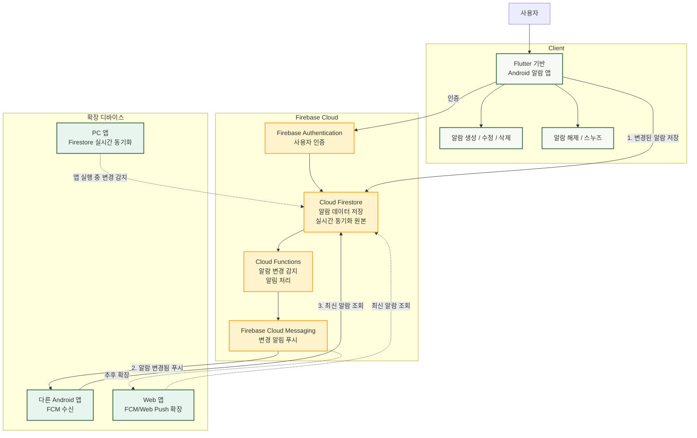

# 1. 팀프로젝트 제안서 내용

## (1) 프로그램 개요 및 설명

### 프로젝트명

**Android 우선 실시간 동기화 알람 앱**

### 개발 배경

기존 알람 앱은 대부분 한 기기 안에서만 동작합니다. 스마트폰에서 알람을 설정하더라도 다른 기기와 알람 상태를 공유하거나, 알람 해제와 스누즈 같은 제어 상태를 함께 관리하기 어렵습니다.

본 프로젝트는 먼저 Android 앱에서 알람 기능을 안정적으로 구현하고, 이후 다른 플랫폼으로 확장할 수 있는 구조를 목표로 합니다. 수업 프로젝트 범위에서는 세부 기술을 과하게 고정하기보다, Android 기본 기능과 동기화 흐름을 완성하는 데 집중합니다.

### 프로그램 설명

사용자는 Android 앱에서 알람을 생성, 수정, 삭제하고 알람이 울릴 때 앱 알림을 받을 수 있습니다. 알람 상태는 Firebase 기반 클라우드 저장소를 통해 관리하여, 이후 Web이나 PC 앱으로 확장할 수 있도록 설계합니다.

기본 구현은 Android 앱을 중심으로 진행하며, Web/Linux/Windows 구현은 Android 기본 기능이 완성된 뒤 확장 계획에 포함합니다.

### 개발 플랫폼 및 기술

- 기본 구현 플랫폼: Android
- 확장 고려 플랫폼: Web, PC 앱
- 개발 프레임워크: Flutter
- 데이터 관리: Firebase 기반 클라우드 저장소
- 알림 기능: Android 푸시 및 로컬 알림
- 디자인 기준: Stitch 생성 알람 앱 디자인

## (2) 전체 구조도 설명

발표용 FigJam 구조도: [Synced Alarm Simple Firebase Proposal Diagram](https://www.figma.com/board/8B2eBuLka5J5P3yXcT1ifS?utm_source=other&utm_content=edit_in_figjam&oai_id=&request_id=b452d917-f2ec-44e7-9385-7b16d8364d4d)

### 구조 설명

전체 구조는 Flutter 기반 Android 앱, Firebase Cloud, 확장 디바이스 영역으로 나눌 수 있습니다. 사용자는 Android 앱에서 알람을 설정하고, 앱은 변경된 알람 정보를 Cloud Firestore에 저장합니다. Firestore는 실제 알람 데이터의 저장소이자 동기화 원본 역할을 합니다.

Cloud Functions는 Firestore의 알람 변경을 감지해 Firebase Cloud Messaging에 변경 알림 전송을 요청합니다. FCM은 알람 데이터 전체를 저장하거나 직접 동기화하는 역할이 아니라, FCM을 지원하는 Android 앱과 Web 앱에 "알람이 변경됨"을 알려주는 푸시 신호 역할을 합니다.

PC 앱은 FCM 직접 수신 대상이 아니라, 앱이 실행 중일 때 Firestore의 실시간 변경을 감지해 최신 알람 상태를 동기화하는 방식으로 확장합니다.

기본 구현 단계에서는 Flutter 기반 Android 앱의 알람 생성, 수정, 삭제, 알림 동작을 우선 완성합니다. 이후 같은 알람 데이터를 Web이나 PC 앱에서도 확인하고 제어할 수 있도록 확장할 수 있습니다.

## (3) 주요 기능 설명

### 기본 구현 기능(Android)

- 알람 생성, 수정, 삭제
- 알람 활성화 및 비활성화
- 알람 이름과 시간 설정
- 알람 목록 표시
- 알람 울림 알림 표시
- 알람 해제 및 스누즈 기능
- 테스트 알람 기능
- 알람 상태 저장 및 동기화

### 확장 구현 기능

- Web에서 알람 목록 확인
- PC 앱에서 알람 목록 확인
- 다른 기기에서 알람 해제 또는 스누즈
- 여러 기기 간 알람 상태 공유

## (4) 팀원 역할 분담 내용

| 팀원 | 담당 영역 | 주요 업무 |
| --- | --- | --- |
| 김준형 |  |  |
| 양상현 |  |  |
| 정준호 |  |  |
| 김민준 |  |  |

## (5) 개발 일정(14주차까지의 일정)

| 주차 | 개발 내용 | 산출물 |
| --- | --- | --- |
| 9주차 | 프로젝트 주제 확정 및 Android 우선 구현 범위 정리 | 제안서, 전체 구조도 |
| 10주차 | Flutter 프로젝트 구성 및 알람 앱 기본 화면 구현 | 메인 화면, 설정 화면 |
| 11주차 | 알람 생성, 수정, 삭제와 기본 저장 흐름 구현 | 알람 관리 기능 |
| 12주차 | Firebase 기반 동기화와 Android 알림 기능 구현 | 동기화 및 알림 기능 |
| 13주차 | 알람 해제, 스누즈, 테스트 알람과 UI 보완 | 개선된 Android 앱 |
| 14주차 | 최종 통합 테스트 및 발표 준비 | 최종 데모, 발표 자료, 제출 문서 |
